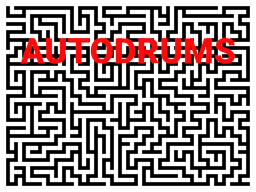

A randomized drum machine.

Play non-repeating drum beats.

This can be used for:

* Create a drum track for twelve tone music intended to be used for modern dance.
* Generate audio that can be sampled and sliced.
* Listening to experimental jazz drums for hours on end.

## Requirements

* SDL2
* Download and extract [the drum samples](http://cdn.mos.musicradar.com/audio/samples/musicradar-drum-samples.zip), either manually or by using `make run`.
* g++ that supports C++20.
* `pkg-config`
* `make`

## Build

Tested on Arch Linux and macOS.

* Build with `make`.

## Keybindings

* Press `r` to randomize the samples.
* Press `p` to pause.
* Press `space` to pause, with a 200ms fade-out.
* Press `esc` to quit.

* Press `a` to play a kick drum sound.
* Press `w` or `f` to play a snare sound.
* Press `d` to play a crash sound.
* Press `s` to play a closed hi-hat sound.
* Press `q` to play a tom sound.
* Press `e` to play a ride sound.
* Press `x` to play an open hi-hat sound.
* Press `return` to play a snare sound with a tiny bit of delay added.

* Press `m` to increase the tempo.
* Press `n` to decrease the tempo.

* Press `y` to use the current settings, don't change the samples.
* Press `i` to toggle "random beat skip".
* Press `j` to toggle "use random beat silence".

* Press `o` to output the current sample indices.

Note that playing too many sounds at the same time does not always work.

* [keydrums](https://github.com/xyproto/keydrums) has a few improvements if the goal is to play drums with the keyboard.

## General info

* Version: 1.0.0
* Author: Alexander F. Rødseth &lt;rodseth@gmail.com&gt;
* License: BSD-3
